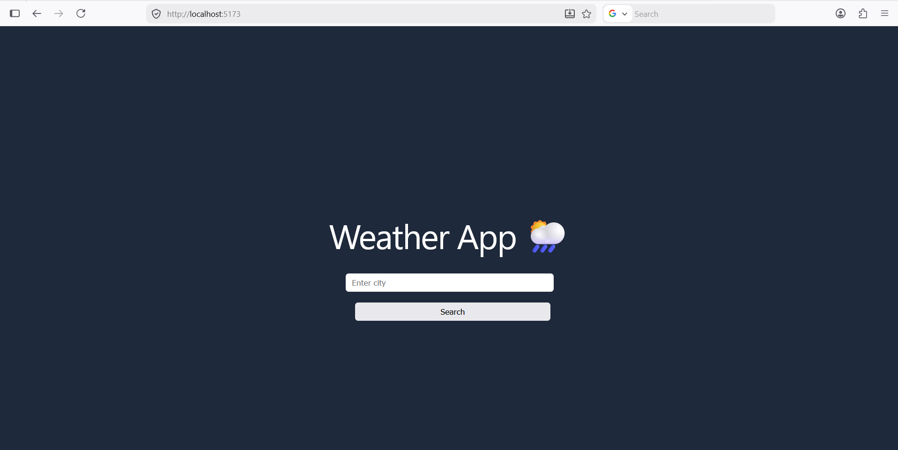
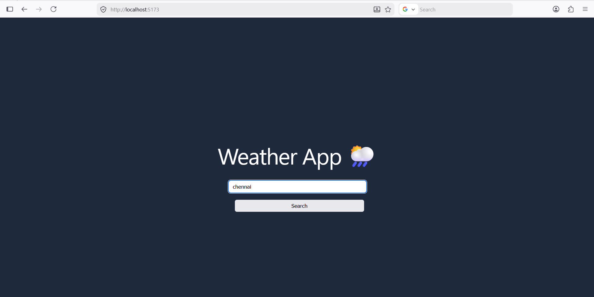
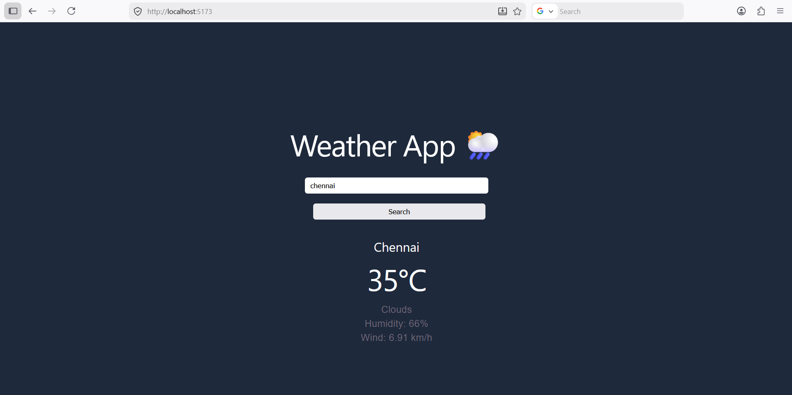

# 🌤️ React Weather App

A modern and responsive weather application built with **React** and **Vite**. It allows users to search for any city and view real-time weather information, including temperature, humidity, wind speed, and weather conditions.

## 🚀 Features

* 🔍 Search weather by city name
* 🌡️ Real-time temperature display
* 💧 Humidity information
* 🌬️ Wind speed details
* 🌥️ Weather condition icons
* 📱 Responsive design for mobile and desktop
* ⚡ Fast performance powered by Vite

## 🛠️ Built With

* **React**
* **Vite**
* **JavaScript**
* **CSS**
* **OpenWeatherMap API** (or your weather API)

## 📦 Installation

1. Clone the repository:

```bash
git clone https://github.com/your-username/react-weather-app.git
```

2. Navigate to the project directory:

```bash
cd react-weather-app
```

3. Install dependencies:

```bash
npm install
```

4. Start the development server:

```bash
npm run dev
```

5. Open your browser and visit:

```
http://localhost:5173
```

## 🔑 Environment Variables

Create a `.env` file in the root directory and add:

```env
VITE_WEATHER_API_KEY=your_api_key_here
```

## 📂 Project Structure

```text
react-weather-app/
├── public/
├── src/
│   ├── components/
│   ├── assets/
│   ├── App.jsx
│   ├── main.jsx
│   └── index.css
├── .env
├── package.json
├── vite.config.js
└── README.md
```

## 📸 Screenshot

Add a screenshot of your application here:








## 📖 Usage

1. Enter a city name in the search box.
2. Click the search button.
3. View current weather details instantly.

## 🤝 Contributing

Contributions are welcome! Feel free to fork this repository and submit a pull request.

## 📜 License

This project is licensed under the MIT License.

---

⭐ If you like this project, give it a star on GitHub!
